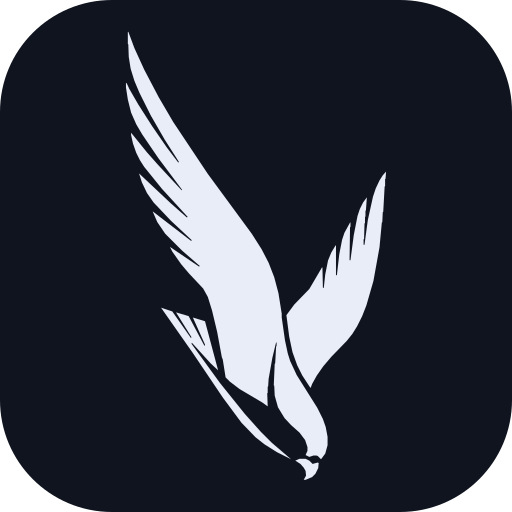

<div align="center">
  
  <h1>Kestral</h1>
  <p><strong>Kestral is a personal-first, open-source workspace where you can build or install focused AI apps for your own recurring work.</strong></p>
  <p>Use Chat when conversation fits; build a purpose-built interface when it does not.</p>
  <p>
    <a href=".github/workflows/ci.yml"></a>
    <a href="docs/alpha-release.md"></a>
    <a href="LICENSE"></a>
    <a href="docs/contributing.md"></a>
  </p>
  <p>
    <a href="docs/getting-started.md">Getting started</a> ·
    <a href="docs/index.md">Documentation</a> ·
    <a href="docs/curated-apps.md">Curated apps</a> ·
    <a href="docs/contributing.md">Contributing</a>
  </p>
</div>

Kestral's central bet is not merely that AI should connect to more existing
services. It is that you should be able to shape the application around a
specific use case of your own: for example, a notes app built around your review
ritual, a domain-specific work queue, or a focused canvas. The app owns that
experience while Kestral supplies shared host capabilities such as app
lifecycle, provider and credential mediation, grants, Runs, and provenance.

Kestral starts with Chat so a new workspace is useful immediately, but Chat is
one ordinary app rather than the presumed interface for every task. Focused apps
can be installed as packages or built independently without forking the host.
Capability actions routed through Kestral use the same grants, Runs, and
provenance path whether an app is bundled or installed later.

The alpha now treats app lifecycle and trust as product behavior rather than
only infrastructure: the Apps workspace exposes installation, curated discovery,
app creation guidance, permission repair, and failed-runtime recovery. As a
conservative host-side guard, a sandboxed custom surface cannot use its own
read/local-write action path without a physical confirmation in host-owned UI
outside the app frame. This is intentionally stricter than standing
silent/notify grants; the longer-term fix is to move a single-use gesture proof
into the kernel boundary or remove the kernel's direct-surface approval shortcut.
Release CI also enforces explicit size ceilings for the shipping Linux and
Windows artifacts.

> **Status: preparing v0.1.0-alpha.1.** This planned first public testing release
> has not been published. It is for developers, early technical testers, and
> contributors. It is not
> production-ready. See the [alpha release notice](docs/alpha-release.md),
> [Getting started](docs/getting-started.md), and
> [alpha limitations](docs/honest-gaps.md).

## Quick start

Run the kernel suite or start the native desktop development host:

```sh
cargo test -p app-host-kernel

cd host
npm install
npm run tauri dev
```

Or scaffold a standalone focused app from the repository root:

```sh
node scripts/create-app.mjs ../my-focus-app \
  --id com.example.my-focus-app \
  --name "My Focus App"
```

## Documentation

The self-contained 0.1 series documentation lives under [`docs/`](docs/):

- [Getting started](docs/getting-started.md)
- [Using Kestral](docs/user-guide.md)
- [Building and connecting apps](docs/extending-kestral.md)
- [Architecture](docs/architecture.md)
- [Trust model](docs/trust-model.md)
- [Operations](docs/operations.md)
- [v0.1.0-alpha.1 release notice](docs/alpha-release.md)
- [Security policy](SECURITY.md)
- [Alpha limitations](docs/honest-gaps.md)
- [Contributing](docs/contributing.md)

## License

Kestral is available under the [MIT License](LICENSE).
